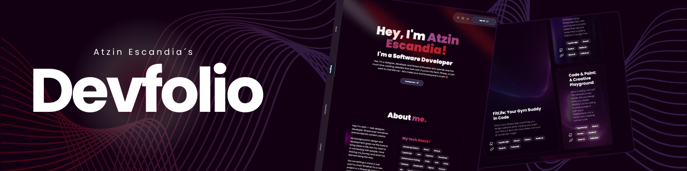

<div align="center">
  <br />
  <a href="https://devfolio-atzin.vercel.app/" target="_blank">
    
  </a>
  <br />

  <div>
    <a href="https://nextjs.org/" target="_blank">
      
    </a>
    <a href="https://www.framer.com/motion/" target="_blank">
      
    </a>
    <a href="https://tailwindcss.com/docs" target="_blank">
      
    </a>
  </div>

  <h3 align="center">Atzin Escandia's Devfolio</h3>
  <p align="center">A super easy, simple, and neon purple (pretty me) ready to create your developer portfolio. Because who has time for complicated setups?</p>
</div>

## 📋 Table of Contents

1. 💡 [Why This Project?](#why-this-project)
2. ⚙️ [Tech Stack](#tech-stack)
3. 🛠️ [Features](#features)
4. 🚀 [Getting Started](#getting-started)
5. 🌟 [Portfolio Inspiration](#portfolio-inspiration)
6. 📝 [More Resources](#more-resources)

## 💡 Why This Project?

Hey there, dev! 👋

You know that feeling when you're ready to show off your skills but get overwhelmed trying to build the *perfect* portfolio? I’ve been there. You start searching for the right design, the best tools, the *ideal* way to present your awesomeness... only to get stuck in a rabbit hole.

So, I thought: **why not create something that makes this super simple, fast, and, dare I say, fun?** This portfolio template is for developers who want to get their work online without spending days tweaking code and layouts.

## ⚙️ Tech Stack

- **Next.js**: Because who doesn’t love fast, production-ready sites that *just work*?
- **Framer Motion**: Transform your portfolio into an interactive experience with smooth animations.
- **TailwindCSS**: The magic wand for styling without the headache.
- **TypeScript**: Because you deserve to code with confidence and zero guesswork.

## 🛠️ Features

✨ **Responsive Design**: Your portfolio will look great on any device—bye-bye, broken layouts!  

🎨 **Clean & Stylish UI**: Simple yet stunning—designed to let your work take center stage. No frills, just results.

💡 **Customization Made Easy**: Want to change colors, fonts, or content? Do it without pulling your hair out. Seriously.

🎬 **Smooth Animations**: Thanks to Framer Motion, your portfolio will glide and flip like a pro.

🔧 **Developer Friendly**: Built with devs in mind, using the best tools and practices. You'll feel right at home.

💌 **Easy Contact Section**: Let potential employers, collaborators, or even fans reach out. No need to complicate things!

## 🚀 Getting Started

Ready to launch your portfolio? Follow these simple steps, and you’ll be live in a flash!

### Prerequisites

Before you get started, make sure you have:

- [Git](https://git-scm.com/) installed on your machine.
- [Node.js](https://nodejs.org/) (and Yarn) to manage dependencies.

### Clone the Repository

```bash
git clone https://github.com/atzinescandia/atzin-escandia-devfolio.git
cd atzin-escandia-devfolio
```

### Install Dependencies

Run this command to install all the necessary dependencies:

```bash
yarn install
```

### Run the Development Server

Once you’re all set, fire up the server with:

```bash
yarn dev
```

Now, head to [http://localhost:3000](http://localhost:3000) in your browser and *boom*, your portfolio is ready to shine!

## 🌟 Portfolio Inspiration

Looking for some inspo? Check out these amazing portfolios made using this template!

- [Atzin Escandia Portfolio](https://theplumup.com) - My personal site, where I show off my journey as a web dev and showcase my projects.
- [The Plum Up Purple Neon](https://vscodethemes.com/e/atzinescandia.theplumup/theplumup) - A collection of portfolios by talented devs around the globe.

## 📝 More Resources

- [Next.js Docs](https://nextjs.org/docs) - For when you need to level up your Next.js skills.
- [Framer Motion](https://www.framer.com/motion/) - Bring your animations to life!
- [TailwindCSS Docs](https://tailwindcss.com/docs) - The most efficient way to style your projects without the fuss.

---

Feel free to fork this repo, tweak it to your heart's content, and start showing off your work! If you’ve got any questions or want to contribute, don’t hesitate to open an issue or submit a pull request. I’m always up for some collaboration! 🎉